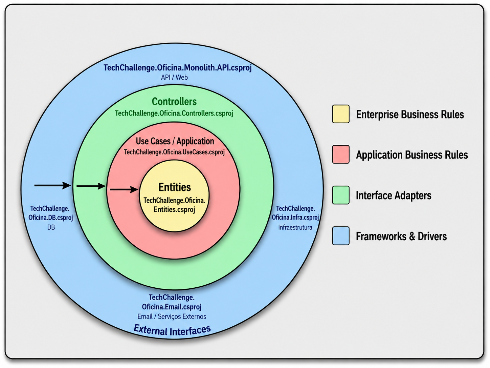
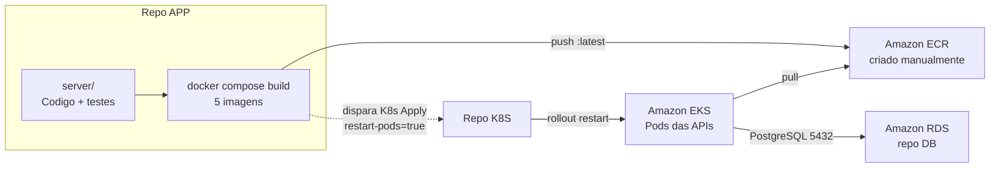
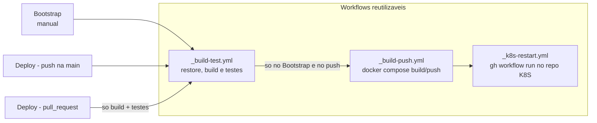

# Projeto Oficina

## 1. Identificação

Software de gestão para uma oficina mecânica.

Tech Challenge da Fase 3 do curso SOAT16 da FIAP. Este repositório guarda a aplicação; a infraestrutura fica nos repositórios K8S e DB (seção 6).

Grupo:
-  Guilherme Toniello Vieira -  SOAT16 - rm374658

### 1.2 Links Úteis

Acesse o blueprint no Miro: http://miro.com/app/board/uXjVHVfHuvI=/?share_link_id=633470424823

Você pode acessar o relatório completo da Fase 2 [aqui](./docs/relatório-completo.pdf). Ele descreve o monorepo da Fase 2, antes da divisão em repositórios.

Vídeo completo da Fase 2 [aqui](https://youtu.be/BRWWTNrfGdY).

## 2. Arquitetura

Nessa seção, será descrita a arquitetura em alto nível e organização da solução.




### 2.1. Visão Geral

As decisões arquiteturais estão documentadas individualmente como ADRs (Architecture Decision Records) em `docs/adr/`.

Abaixo, você encontra um resumo.

| ADR | Resumo | Link |
|-----|--------|------|
| ADR-001 — Clean Architecture com Folder-by-Feature | Adota Clean Architecture com 4 anéis de dependência (Entities, UseCases, Controllers, API/Infra), organizados por feature. Define separação de responsabilidades guiada pela regra de inversão de dependência. | [ver](./docs/adr/ADR-001-Clean-Architecture.md) |
| ADR-002 — DDD e Entidades Ricas | Entidades encapsulam comportamentos e validações de domínio via factory methods obrigatórios. Evita entidades anêmicas; erros de negócio são sinalizados com `DomainException`. | [ver](./docs/adr/ADR-002-DDD-e-Entidades-Ricas.md) |
| ADR-003 — Value Objects para CPF/CNPJ | CPF e CNPJ são encapsulados em Value Objects com validação de dígitos verificadores. `IdentificacaoCliente` detecta o tipo automaticamente e garante que apenas valores válidos existam no domínio. | [ver](./docs/adr/ADR-003-Value-Objects-Identificacao.md) |
| ADR-004 — Gateways e Persistência | Contratos de persistência (Gateways) residem nos UseCases; implementações ficam no projeto DB via EF Core. Leituras retornam coleções materializadas; escritas persistem via `SaveChangesAsync`. | [ver](./docs/adr/ADR-004-Gateways-e-Persistencia.md) |
| ADR-005 — Separação de Commands/Queries/ViewModels | Commands (escrita), Queries (leitura) e ViewModels (resposta) são contratos explícitos na camada de UseCases. A API consome esses contratos diretamente, sem criar os seus próprios. | [ver](./docs/adr/ADR-005-Separacao-Commands-Queries-ViewModels.md) |
| ADR-006 — AutoMapper nos UseCases | Mapeamento entre entidades de domínio e DTOs é responsabilidade exclusiva dos UseCases via AutoMapper. Controllers nunca instanciam `IMapper`; recebem apenas ViewModels já mapeadas. | [ver](./docs/adr/ADR-006-AutoMapper-nos-UseCases.md) |
| ADR-007 — EF Core com PostgreSQL | EF Core 10.x com Npgsql como ORM para PostgreSQL, com migrations versionadas. Configurações de mapeamento via `IEntityTypeConfiguration<T>` e connection string via `appsettings.json`. | [ver](./docs/adr/ADR-007-EFCore-com-PostgreSQL.md) |
| ADR-008 — Swagger para Documentação | Documentação automática de endpoints via Swashbuckle com suporte a autenticação JWT no UI. Swagger UI disponível na raiz da aplicação. | [ver](./docs/adr/ADR-008-Swagger-para-API.md) |
| ADR-009 — Migrações Automáticas no Startup | Migrations pendentes são aplicadas automaticamente ao iniciar a API via `ApplyMigrations()`. Elimina intervenção manual no deploy, incluindo ambientes de container. | [ver](./docs/adr/ADR-009-Migracoes-Automaticas-no-Startup.md) |
| ADR-011 — Envio de E-mail de Orçamento | Notifica o cliente por e-mail ao gerar orçamento via porta de saída `IOrcamentoEmailSender` e provedor Resend. A API funciona normalmente sem a ApiKey; o envio de e-mail é desabilitado. | [ver](./docs/adr/ADR-011-Envio-de-Email-de-Orcamento.md) |
| ADR-012 — Controle de Estoque de Insumos | Verifica estoque ao gerar orçamento (sem reserva) e debita automaticamente ao aprovar. Lança `DomainException` se houver estoque insuficiente em qualquer etapa. | [ver](./docs/adr/ADR-012-Controle-de-Estoque-de-Insumos.md) |
| ADR-013 — Tratamento de Erros em Duas Camadas | Erros de negócio esperados são tratados nos controllers com resposta HTTP semântica (4xx). Erros inesperados são capturados pelo middleware global, evitando vazamento de stack trace. | [ver](./docs/adr/ADR-013-Estrategia-de-Tratamento-de-Erros-em-Duas-Camadas.md) |

### 2.2. Autenticação

O projeto usa autenticação via JWT emitido pelo `Auth0` (http://auth0.com/) como provedor de identidade.

**Como funciona na prática:**

A API valida cada requisição verificando o JWT no header `Authorization: Bearer <token>`. A integração usa o pacote `Microsoft.AspNetCore.Authentication.JwtBearer`. As configurações ficam em `appsettings.json` na chave `AuthSettings`:

```json
"AuthSettings": {
  "Authority": "<seu-dominio>.us.auth0.com",
  "Audience": "http://localhost:7194"
}
```

O `Authority` aponta para o domínio Auth0, que expõe o endpoint `/.well-known/openid-configuration` usado pelo middleware para buscar as chaves públicas de validação. O `Audience` identifica esta API junto ao Auth0.

Todos os endpoints exigem autenticação por padrão (política de fallback `RequireAuthenticatedUser`). O único endpoint público é `/health`.

**Você não precisa criar uma conta no Auth0.** A Collection do Postman em `/e2e` já possui um request configurado com as credenciais de demonstração para obter o token de acesso via Client Credentials Flow.

### 2.3. CQRS (CQS)

O padrão implementado é o **CQS (Command Query Separation)** — o nível mais básico do CQRS — sem separação de banco de dados para leitura e escrita.

A separação acontece na **camada de UseCases** (`3 - Application Business Rules`). Cada feature é organizada com as seguintes pastas:

- `Commands/` — objetos de entrada para operações de escrita (ex: `CriarClienteCommand`, `AtualizarClienteCommand`)
- `Queries/` — objetos de entrada para operações de leitura (ex: `ListarClientesQuery`, `ObterClientePorIdQuery`)
- `ViewModels/` — objetos de saída (resposta da API)
- `UseCases/` — a classe que executa a operação, recebendo um `Command` ou uma `Query` como parâmetro tipado

O benefício é tornar a **intenção explícita no contrato**: ao receber um `Command`, sabe-se que haverá efeito colateral; ao receber uma `Query`, sabe-se que é apenas leitura. Não há mediator (ex: MediatR), o roteamento é feito diretamente via injeção de dependência.

## 3. Referências Bibliográficas

### 3.1. Padrões de Arquitetura

Esse projeto foi construído usando os padrões descritos abaixo.

- Clean Architecture (4 anéis e regra de dependência)
  - ADR: [ADR-001](./docs/adr/ADR-001-Clean-Architecture.md)
  - Codigo: [server/](./server/)
- Domain-Driven Design (DDD)
  - ADR: [ADR-002](./docs/adr/ADR-002-DDD-e-Entidades-Ricas.md)
  - Codigo: [Entidades de dominio](./server/4%20-%20Enterprise%20Business%20Rules/TechChallenge.Oficina.Entities/)
- CQS (separação entre Commands e Queries)
  - ADR: [ADR-005](./docs/adr/ADR-005-Separacao-Commands-Queries-ViewModels.md)
  - Codigo: [UseCases](./server/3%20-%20Application%20Business%20Rules/TechChallenge.Oficina.UseCases/)

### 3.2. Padrões Estruturais

- Folder-by-Feature
  - ADR: [ADR-001](./docs/adr/ADR-001-Clean-Architecture.md)
- Gateway/Repository para persistência
  - ADR: [ADR-004](./docs/adr/ADR-004-Gateways-e-Persistencia.md)
  - Codigo: [Gateways DB](./server/1%20-%20Frameworks%20%26%20Drivers/TechChallenge.Oficina.DB/)
- Mapper/Adapter (AutoMapper nos UseCases)
  - ADR: [ADR-006](./docs/adr/ADR-006-AutoMapper-nos-UseCases.md)
  - Codigo: [UseCases](./server/3%20-%20Application%20Business%20Rules/TechChallenge.Oficina.UseCases/)
- Dependency Injection (Inversion of Control)
  - Codigo: [Program.cs](./server/1%20-%20Frameworks%20%26%20Drivers/TechChallenge.Oficina.Monolith.API/Program.cs)
- Service Layer (aplicada na camada de UseCases)
  - Codigo: [UseCases](./server/3%20-%20Application%20Business%20Rules/TechChallenge.Oficina.UseCases/)

### 3.3. Padrões de Design

- Factory Method (entidades ricas com métodos de criação)
  - ADR: [ADR-002](./docs/adr/ADR-002-DDD-e-Entidades-Ricas.md)
- Value Object (CPF/CNPJ e identificação)
  - ADR: [ADR-003](./docs/adr/ADR-003-Value-Objects-Identificacao.md)
- DTO/ViewModel Pattern
  - ADR: [ADR-005](./docs/adr/ADR-005-Separacao-Commands-Queries-ViewModels.md)
- Centralized Exception Handling (duas camadas: controller + middleware)
  - ADR: [ADR-013](./docs/adr/ADR-013-Estrategia-de-Tratamento-de-Erros-em-Duas-Camadas.md)
  - Codigo: [Middleware](./server/1%20-%20Frameworks%20%26%20Drivers/TechChallenge.Oficina.Monolith.API/Middleware/) e [Controllers](./server/2%20-%20Interface%20Adapters/TechChallenge.Oficina.Controllers/)

### 3.4. Padrões Comportamentais

- CQS (Command Query Separation)
  - ADR: [ADR-005](./docs/adr/ADR-005-Separacao-Commands-Queries-ViewModels.md)
  - Implementacao: Commands (escrita), Queries (leitura), ViewModels (resposta)
- Domain Exceptions para regras de negócio e invariantes
  - ADR: [ADR-002](./docs/adr/ADR-002-DDD-e-Entidades-Ricas.md)
  - Codigo: [Exceptions](./server/4%20-%20Enterprise%20Business%20Rules/TechChallenge.Oficina.Entities/Exceptions/)

### 3.5. Referências

#### 3.5.1. Livros e Artigos

MARTIN, Robert C. Clean Architecture: A Craftsman's Guide to Software Structure and Design. Boston: Prentice Hall, 2017.

EVANS, Eric. Domain-Driven Design: Tackling Complexity in the Heart of Software. Boston: Addison-Wesley, 2003.

VERNON, Vaughn. Implementing Domain-Driven Design. Boston: Addison-Wesley, 2013.

FOWLER, Martin. Patterns of Enterprise Application Architecture. Boston: Addison-Wesley, 2003.

GAMMA, Erich; HELM, Richard; JOHNSON, Ralph; VLISSIDES, John. Design Patterns: Elements of Reusable Object-Oriented Software. Boston: Addison-Wesley, 1994.

MARTIN, Robert C. Agile Software Development, Principles, Patterns, and Practices. Upper Saddle River: Prentice Hall, 2002.

#### 3.5.2. Material de Apoio

FOWLER, Martin. CQRS. Martin Fowler, 14 jul. 2011. Disponível em: http://martinfowler.com/bliki/CQRS.html. Acesso em: 10 jun. 2026.

FOWLER, Martin. Inversion of Control Containers and the Dependency Injection pattern. Martin Fowler, 23 jan. 2004. Disponível em: http://martinfowler.com/articles/injection.html. Acesso em: 02 jun. 2026.

## 4. Executando o Projeto

Para executar o projeto localmente, na sua maquina dev, temos 3 alternativas descritas nas subseções `4.2`, `4.3` e `4.4`.

Siga apenas 1 delas.

### 4.1. Pré-requisito

Se você for rodar sem container, vai precisar:

- dotnet 10.x
http://dotnet.microsoft.com/pt-br/download/dotnet/thank-you/sdk-10.0.301-windows-x64-installer

- Postgres instalado e com instância ativa: http://www.postgresql.org/

Para containers, precisa do docker (http://www.docker.com/) ou Podman (http://podman.io/) instalado.

Já temos docker-compose pronto com todas as configurações.

> Recomenda-se o uso de containers

### 4.1.1. Configuração por .env (recomendado para container)

Existe um arquivo de exemplo na raiz do projeto: `.env.example`.

Passo 1 - gere o arquivo `.env` a partir do exemplo.

- Linux/macOS: `cp .env.example .env`
- Windows PowerShell: `Copy-Item .env.example .env`

Passo 2 - ajuste as variáveis conforme necessário, principalmente:

- `POSTGRES_PORT`
- `API_MONOLITH_PORT`
- `DATABASE_CONNECTION_STRING`
- `RESEND_API_KEY` (opcional)

### 4.2. Alternativa A - Containers (docker, podman, ...)

Passo 1 - Com o console apontado para o root do repositório, execute `docker compose up -d --build`

Se estiver usando o podman, use `podman compose up -d --build`

E pronto!

O banco de dados `postgres` e a `api` estarão disponíveis.

Passo 2 - Use `http://localhost:7194/index.html` para acessar o swagger.

### 4.3. Alternativa B - Local com dotnet cli

Passo 1 - rode o `postgres` - pode ser uma instância local ou via container `docker compose up -d postgres`.

Passo 2 - aponte o console para a pasta `server/1 - Frameworks & Drivers/TechChallenge.Oficina.Monolith.API/` e então execute `dotnet run`

Pronto!

Vai subir a API usando http com um certificado autoassinado do dotnet.

Passo 3 - Use `http://localhost:7194/index.html` para acessar o Swagger.

### 4.4. Alternativa C - Local com Visual Studio 2026 ou VS Code

Passo 1 - rode o `postgres` - pode ser uma instância local ou via container `docker compose up -d postgres`.

Passo 2 - abra o arquivo `.slnx` em `/server`

Passo 3 - no Visual Studio, rode usando o perfil `http`.

Passo 4 - Use `http://localhost:7194/index.html` para acessar o Swagger.


### 4.5  Banco de dados

Para popular o banco de dados, use a Collection do Postman na pasta `/e2e`.

Não temos scripts SQL ou endpoint específico, apenas use a collection que ela irá popular o banco e executar demais operações de demonstração.

Se você estiver rodando em container, não é preciso configurar mais nada, apenas rodar, a connection string já está certa.

Se você está rodando o Postgres localmente, com instância não containerizada, precisa configurar a connection string em `server/1 - Frameworks & Drivers/TechChallenge.Oficina.Monolith.API/appsettings.json`, na chave `DatabaseSettings:ConnectionString`.

Para um cluster Kubernetes local, os manifests do Postgres estão em [k8s/db-local](./k8s/db-local) (veja a seção 6.3). Na AWS, o banco é o Amazon RDS do repositório DB.

### 4.6. Rodando os testes

Os testes automatizados estão organizados em `server/Tests/` por camada da arquitetura.

Para executar todos os testes da solução, use:

`dotnet test ./server/TechChallenge.Oficina.API.slnx`

Se quiser executar apenas um projeto de teste específico, use o `.csproj` correspondente em `server/Tests/`.

### 4.7. Problemas comuns (troubleshooting)

1. Porta 5432 em uso
Se o Postgres não subir na porta padrão, altere `POSTGRES_PORT` no arquivo `.env` (por exemplo, `5433`) e ajuste também `DATABASE_CONNECTION_STRING` para usar a mesma porta.

2. Erro de autenticação JWT (401)
Verifique se `AuthSettings:Authority` e `AuthSettings:Audience` no `appsettings.json` correspondem exatamente ao token usado pela collection.

3. E-mail não está sendo enviado
Sem `RESEND_API_KEY` (container) ou `ApiKey` no `appsettings.json` (execução local), a API continua funcionando, mas o envio de e-mail fica desabilitado por configuração. O e-mail de mudança de status também depende de `ResendSettings:SendEmailOnStatusChange`, que é `false` nos `appsettings.json`. Para ligá-lo, defina `ResendSettings__SendEmailOnStatusChange=true`.

## 5. Requisitos Implementados

Abaixo, você encontra uma tabela com o resumo dos requisitos de negócio da Fase 2 que foram implementados.

| Requisito | Atende? | Observação de escopo | API | Evidências (server/) |
|---|---|---|---|---|
| Consulta de status da Ordem de Serviço (OS) | Sim | Consulta de status disponível no fluxo de OS. | `TechChallenge.Oficina.StatusService.API` (API dedicada para consulta de status): [StatusOrdemServicoEndpoints](./server/1%20-%20Frameworks%20%26%20Drivers/TechChallenge.Oficina.StatusService.API/Features/OrdensServico/StatusOrdemServicoEndpoints.cs) | [Endpoints OS](./server/1%20-%20Frameworks%20%26%20Drivers/TechChallenge.Oficina.Monolith.API/Features/OrdensServico/OrdensServicoEndpoints.cs) · [Controller OS](./server/2%20-%20Interface%20Adapters/TechChallenge.Oficina.Controllers/Features/OrdensServico/OrdensServicoController.cs) |
| Aprovação/recusa de orçamento por endpoint externo | Sim | Aprovação e recusa implementadas no fluxo da OS. | `TechChallenge.Oficina.ApprovalService.API` (API dedicada para aprovação/recusa de orçamento): [ApprovalServiceEndpoints](./server/1%20-%20Frameworks%20%26%20Drivers/TechChallenge.Oficina.ApprovalService.API/Features/OrdensServico/ApprovalServiceEndpoints.cs) | [Endpoints OS](./server/1%20-%20Frameworks%20%26%20Drivers/TechChallenge.Oficina.Monolith.API/Features/OrdensServico/OrdensServicoEndpoints.cs) · [UseCases OS](./server/3%20-%20Application%20Business%20Rules/TechChallenge.Oficina.UseCases/Features/OrdensServico/UseCases/OrdemServicoUseCases.cs) |
| Abertura de OS com cliente, veículo, serviços e peças, retornando ID único | Sim | Abertura completa com retorno da identificação da OS. | `TechChallenge.Oficina.CreateOSService.API` (API dedicada para abertura da OS): [CriarOSCompletaEndpoints](./server/1%20-%20Frameworks%20%26%20Drivers/TechChallenge.Oficina.CreateOSService.API/Features/OrdensServico/CriarOSCompletaEndpoints.cs) | [Controller OS](./server/2%20-%20Interface%20Adapters/TechChallenge.Oficina.Controllers/Features/OrdensServico/OrdensServicoController.cs) · [ViewModel Abertura](./server/3%20-%20Application%20Business%20Rules/TechChallenge.Oficina.UseCases/Features/OrdensServico/ViewModels/AberturaOrdemServicoViewModel.cs) |
| Listagem de OS por prioridade + antiguidade, excluindo finalizadas/entregues | Sim | Escopo acordado: endpoint ordenado /ordenadas. | `TechChallenge.Oficina.GetOSService.API` (API dedicada para consultas e listagem de OS): [GetOrdensServicoEndpoints](./server/1%20-%20Frameworks%20%26%20Drivers/TechChallenge.Oficina.GetOSService.API/Features/OrdensServico/GetOrdensServicoEndpoints.cs) | [Gateway OS](./server/1%20-%20Frameworks%20%26%20Drivers/TechChallenge.Oficina.DB/Features/OrdensServico/OrdemServicoGateway.cs) · [Query Ordenada](./server/3%20-%20Application%20Business%20Rules/TechChallenge.Oficina.UseCases/Features/OrdensServico/Queries/ListarOrdensServicoOrdenadasQuery.cs) |
| Atualização de status da OS com notificação ao cliente | Sim | A cada mudança de status da OS, o cliente é notificado por e-mail no fluxo de controller/use case, independentemente da API que executa a alteração. | Atualmente, os endpoints de alteração de status estão em `TechChallenge.Oficina.Monolith.API`: [OrdensServicoEndpoints](./server/1%20-%20Frameworks%20%26%20Drivers/TechChallenge.Oficina.Monolith.API/Features/OrdensServico/OrdensServicoEndpoints.cs). A regra de notificação é centralizada no controller/use case e pode ser reutilizada por APIs dedicadas. | [UseCases OS](./server/3%20-%20Application%20Business%20Rules/TechChallenge.Oficina.UseCases/Features/OrdensServico/UseCases/OrdemServicoUseCases.cs) · [Sender Status](./server/1%20-%20Frameworks%20%26%20Drivers/TechChallenge.Oficina.Email/Features/OrdensServico/OrdemServicoStatusEmailSender.cs) |


## 6. Infraestrutura e repositórios

Na Fase 3, o projeto está dividido em quatro repositórios. Este (**APP**) guarda o código da aplicação, os testes, os Dockerfiles e as pipelines que buildam as imagens e as publicam no Amazon ECR.

| Repositório | Responsabilidade |
|---|---|
| **APP** (este) | Código .NET, testes, imagens Docker e push para o ECR |
| [K8S](https://github.com/GuiToniello/tech-challenge-fase-3-K8S-soat16-rm374658) | VPC, Amazon EKS, addons (`ingress-nginx`, Metrics Server) e manifests Kubernetes das APIs. Também gera o Secret com a connection string do RDS e a chave do Resend |
| [DB](https://github.com/GuiToniello/tech-challenge-fase-3-DB-soat16-rm374658) | Amazon RDS PostgreSQL. O schema é criado pelas migrations das APIs, no startup (ADR-009) |
| LAMBDA | Função Lambda do projeto |

Ordem de deploy entre os repositórios: **K8S** Bootstrap → **DB** Bootstrap → **APP** Bootstrap (imagens no ECR) → **K8S** K8s Apply. O último passo é disparado automaticamente por este repositório (seção 7). O APP não tem nada a destruir: o ECR é criado manualmente e fica fora de qualquer `destroy`.



### 6.1 Contrato com os outros repositórios

| Item | Valor |
|---|---|
| Imagens | `903936907231.dkr.ecr.us-east-1.amazonaws.com/techchallenge-oficina-{monolith,approval,createos,getos,status}:latest`, os mesmos nomes do `docker-compose.yml`. Os manifests do repo K8S usam `:latest` com `imagePullPolicy: Always` |
| Porta e health | Todas as APIs escutam em `8080` e expõem `/health` (probes do K8S) |
| Configuração | Em AWS, `DatabaseSettings__ConnectionString` e `ResendSettings__ApiKey` vêm do Secret `oficina-api-secrets`, gerado pelo repo K8S. Os ConfigMaps do repo K8S definem só `ASPNETCORE_*`, `AllowedHosts` e `Logging`. `AuthSettings` e o restante de `ResendSettings` (`FromEmail`, `SendEmailOnStatusChange`) vêm do `appsettings.json` da imagem |
| Banco | As migrations do EF Core rodam no startup de 4 das 5 APIs (Monolith, CreateOS, GetOS e Status). A ApprovalService não aplica migrations. Com o RDS novo (vazio), as tabelas são criadas quando as APIs sobem |

### 6.2 ECR (manual)

Crie uma vez, em `us-east-1`, os 5 repositórios privados com *tag mutability* **MUTABLE**. A tag `latest` é sobrescrita a cada push, e com IMMUTABLE o segundo push falha:

- `techchallenge-oficina-monolith`
- `techchallenge-oficina-approval`
- `techchallenge-oficina-createos`
- `techchallenge-oficina-getos`
- `techchallenge-oficina-status`

### 6.3 Kubernetes local

Os manifests de [k8s/db-local](./k8s/db-local) sobem só o Postgres num cluster Kubernetes **local** e **não** devem ser aplicados na AWS. Os manifests das APIs ficam no repositório K8S. Para apontá-las para esse Postgres, siga o [README do db-local](./k8s/db-local/README.md), que traz a connection string do `k8s/.env`.

Os manifests usam o namespace `oficina`, que é definido no repositório K8S. Num cluster local sem os manifests de lá, crie o namespace antes:

```powershell
kubectl create namespace oficina
kubectl apply -f k8s/db-local
```

## 7. Fluxo de Deploy (CI/CD)

O CI/CD usa GitHub Actions. Dois workflows de entrada chamam três workflows reutilizáveis:

- **Bootstrap** (manual): build + testes → build e push das 5 imagens no ECR → dispara o K8s Apply no repo K8S. Use-o na primeira publicação, depois do Bootstrap do repo DB, e para republicar a HEAD da `main`.
- **Deploy**:
  - Pull Request para a `main`: build + testes. É o check obrigatório `build-test / build-test`.
  - Push na `main` com mudança em `server/**`, `docker-compose.yml` ou nos workflows: build + testes → push no ECR → dispara o K8s Apply.



O push das imagens só roda a partir da `main`: disparado em outra branch, o job falha com erro.

**Primeiro push na `main`:** o primeiro push deste código já roda o Deploy completo, porque muda `server/**`. Para ele funcionar, crie antes os repositórios ECR (6.2) e configure os secrets e variables. Se o cluster ou o RDS ainda não existirem, as imagens são publicadas, mas o K8s Apply disparado falha no repo K8S. Nesse caso, siga a ordem da seção 6 e rode o Bootstrap depois. **Desative também os workflows do repositório da fase 2**, que publicam nos mesmos repositórios ECR e com a mesma tag. Os detalhes, os secrets e as variables estão em [.github/workflows/README.md](./.github/workflows/README.md).

## 8. Finalização

Nessa seção, você encontra observações gerais.

- Para fazer requisições, use as Collections do Postman na pasta `/e2e`
  - importe as collections no Postman
  - cada API tem um collection
  - Em `variables`, altere para apontar a URL para onde está rodando o projeto.
  - Na AWS, use o hostname do Load Balancer do ingress (repo K8S) com o prefixo de cada API: `http://<hostname>/monolith`, `/approval`, `/createos`, `/getos` e `/status`. `oficinaApiBaseUrl` deve apontar para `http://<hostname>/monolith`.

- Para o envio de e-mails, é preciso configurar `ApiKey` no appsettings.json ou `ResendSettings__ApiKey` para container

Você pode criar uma conta em http://resend.com/ e gerar a ApiKey.

Sem a ApiKey, a API funciona normalmente, só não envia os e-mails.
